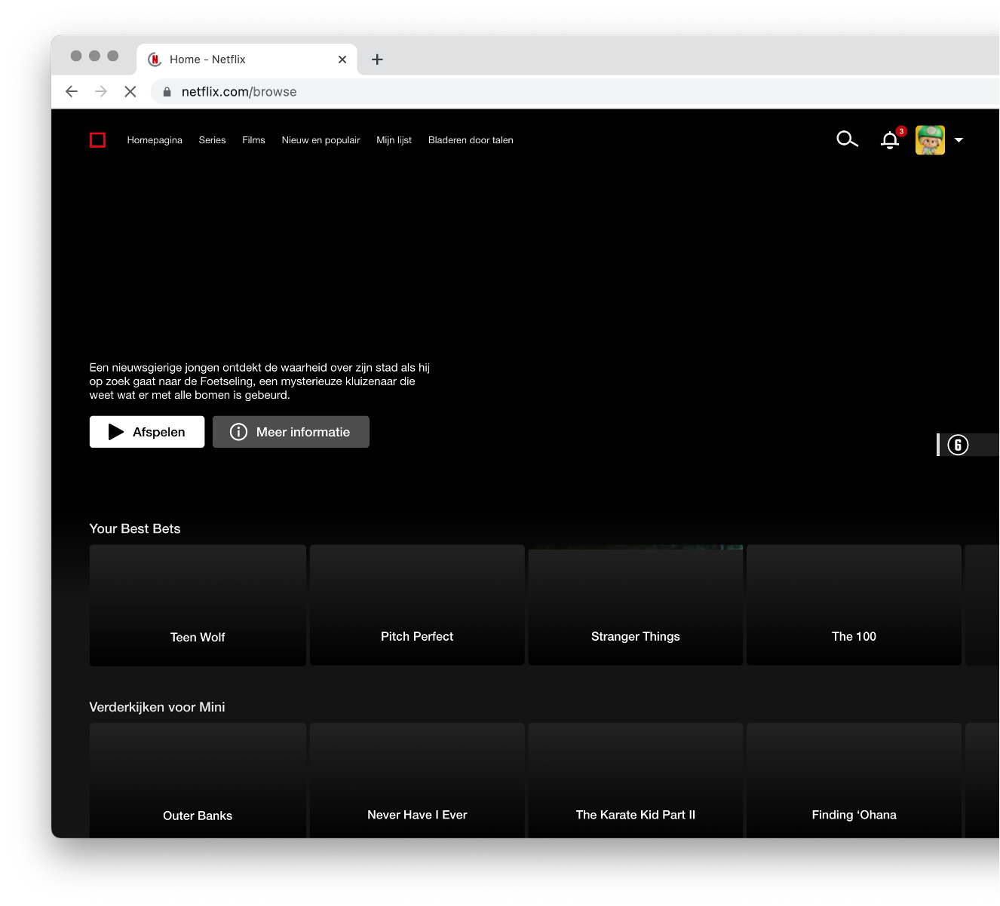

# Enhanced Website

## Perceived Performance 
Over lazy loading, loading states en hoe je er voor kan zorgen dat gebruikers een website als snel ervaren.

### Wat is Perceived Performance?

Performance is afhankelijk van hoe snel je mobiel is, hoe snel internet je hebt, hoe snel een server reageert, hoeveel plaatjes of video's op een pagina staan, hoeveel Javascript en fonts geladen moeten worden, ... het ligt er aan ...

Philip Walton schreef in zijn artikel over _user-centric performance_ op [web.dev](https://web.dev/articles/user-centric-performance-metrics):

> Performance is relative.

Door verschillende performance technieken toe te passen kan je ervoor zorgen dat een website sneller laadt. Daarnaast kan je ervoor zorgen dat de gebruiker het *gevoel* heeft dat een website sneller laadt of reageert. Dit noemen we _Perceived Performance_. Dit is het psychologische effect van het wachten. Als je de gebruiker de juiste feedback geeft, zoals loaders, micro-interacties en slimme animaties, zal die het gevoel hebben dat jouw website soepel werkt en snel laadt.

### Skeleton screens
In het artikel [#59 - Have you optimized for perceived performance?](https://www.smashingmagazine.com/2021/01/front-end-performance-2021-free-pdf-checklist/#59) van de Frontend Performance Checklist verschillende dingen die je kan doen om de gebruiker het gevoel te geven dat een website sneller werkt. 

 
*Netflix Skeleton Screen*

Een Skelton screen is een lege versie van de pagina, waarin de content zoal plaatjes en video's nog moet worden geladen. Voordat de content geladen wordt is de outline van de interface al zichtbaar. 
Doordat er snel al iets op de pagina te zien is, krijgen gebruiker het gevoel dat de website sneller laadt.

Let op. Hier moet wel een kanttekening geplaatst worden. Het is namelijk niet altijd dat een skeleton screen als snel ervaren wordt. Er is [onderzoek](https://www.viget.com/articles/a-bone-to-pick-with-skeleton-screens/) gedaan waarbij een _skelton screen_ en een _loader_ worden vergeleken met een _blank screen_. De uitkomst? Het ligt er aan ... het is niet zo dat een skeleton screen altijd de beste oplossing is.

 
*3 variaties van het laden van een website vergeleken*

### Cheat the UX
Stéphanie Walter vertelt in haar lezing "Cheating The UX When There Is Nothing More To Optimize" dat je in de interface verschillende dingen kan doen die ervoor zorgen dat een gebruiker het gevoel heeft dat de website snel laadt en soepel werkt. Zoals loaders en _progress bars_, _micro-interactions_, _optimistic UI_, _User distractions_ en _progressive asset display_.

#### Visual Time Response voor Interfaces
De _visual time response_ is de tijd die voorbij gaat voordat er iets gebeurt. 

##### Instant response <300ms
Als een interactie niet langer duurt dan 300 miliseconden ervaart de gebruiker dat als 'instant response', de interface reageert direct. Dit geldt voor bijvoorbeeld voor button states zoals :hover en :focus. 

##### Normal Delay 300ms - 2s
Als een interactie of het laden van content sneller gaat dan 2 seconden, is er geen extra feedback nodig. De gebruiker zal dan niet het gevoel krijgen dat iets te lang duurt.

##### System is thinking 2 - 5s
Als het laden van content lander duurt dan 2 seconden, dan zal je de gebruiker feedback moeten even dat er iets gebeurt, een loading state.

##### Do something extra >5s
Duurt een interactie of het laden van content langer dan 5 sconden? Dan zul je de gebruiker duidelijk moeten maken waarom iets zo lang duurt. Bijvoorbeeld bij het uploaden van content zorg je ervoor dat in de interface duidelijk is wat er gebeurt en hoe lang het nod duurt.

#### Illusies en slimme animaties 

##### Ease-out animaties 
Gebruik Ease-out animaties als de interface direct moet reageren, zoals voor button states en het menu.

##### Ease-in animaties 
Gebruik Ease-in animaties voor het tonen van informatie zoals prompt, modal, succes states en error meldingen

##### Progress bar
Als je een progress bar naar het einde toe laat versnellen, zal de gebruiker het gevoel krijgen dat iets sneller is geladen. 

## Opdracht Perceived Performance
Pas Perceived Performance technieken toe op de client-side code van je POST interactie.

Lees eerst het onderdeel Perceived Performance van de Frontend Performance Checklist. Maak aantekeningen in je issue.

Ga daarna ontwerpen in Figma: 
- Pas de _Visual Time Response_ toe op de interactie en loading states die je hebt gemaakt in sprint 9. 
- Instant response: Ontwerp de states voor de buttons. Heb je een ease-in of ease-out animaties voor nodig voor de button states?
- System is thinking: Ontwerp de loading animatie in de huisstijl van de opdrachtgever. Voeg zo nodig een skeleton state toe als de content (bijna) geladen wordt
- Maak een break-down van de client-side JS en CSS die je nodig hebt. Kan je bedenken hoe je dit kan coderen? 
- Build, and have fun!

### Bronnen
- [Have you optimized for perceived performance?- Frontend Performance Checklist #59](https://www.smashingmagazine.com/2021/01/front-end-performance-2021-free-pdf-checklist/#59)
- [Cheating The UX When There Is Nothing More To Optimize, Stéphanie Walter](https://stephaniewalter.design/blog/cheating-ux-perceived-performance-and-user-experience/)
- [A Bone to Pick with Skeleton Screens](https://www.viget.com/articles/a-bone-to-pick-with-skeleton-screens/)
